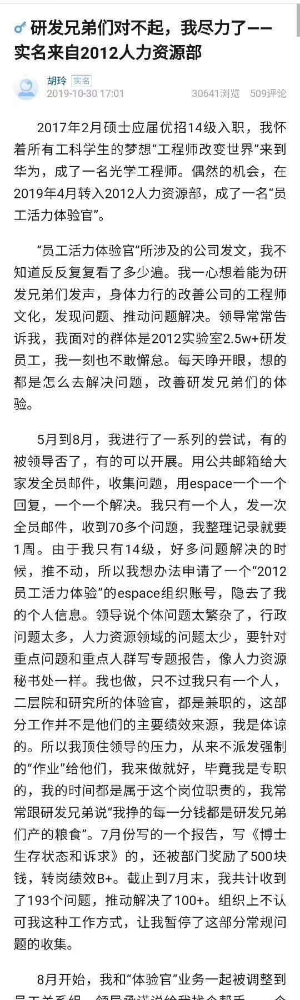
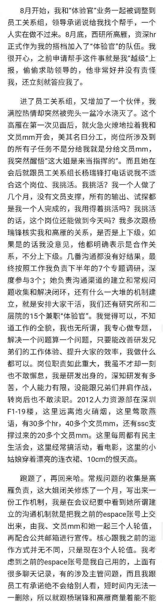
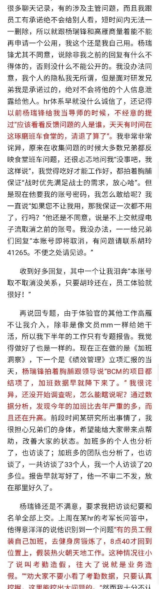
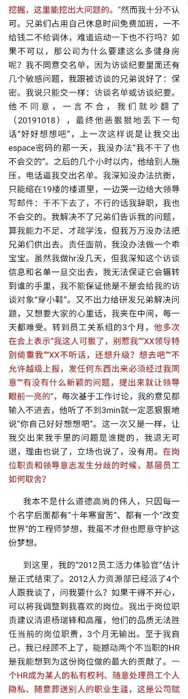
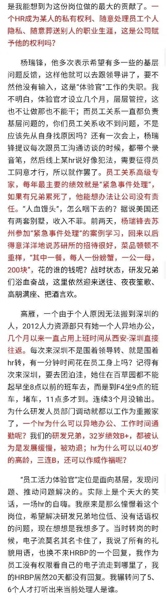
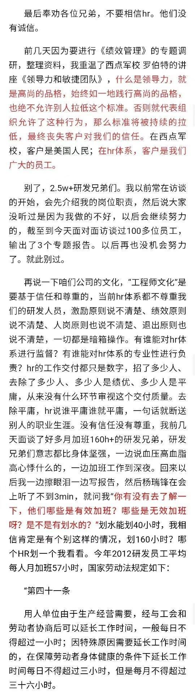
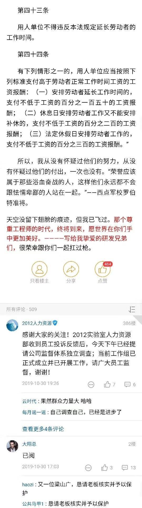
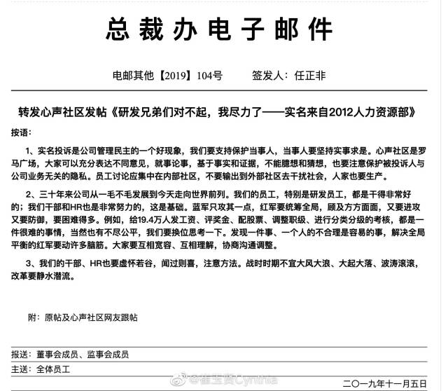

# 华为 HR 五千字实名控诉：研发兄弟一个月加班 160 小时却被说不努力
## 事情经过
### 2019.10.30
华为 2012 实验室 HR 胡玲在华为心声论坛实名发帖，内容直指部分 HR 领导、华为部分 HR 政策导向及华为企业文化，并称：“奉劝各位兄弟，不要相信 HR，他们没有诚信“。  

  
  
  
  
  
  
  

### 2019.10.31
知乎有网友提问「[如何看待华为 HR 胡玲于 2019.10.30 在华为内部论坛心声社区的发帖？](https://www.zhihu.com/question/353381490)」，随后事件开始发酵，在知乎上有约 4 万人关注了该问题，两千多万阅读量。

### 2019.11.5
华为内部回应：

  

## 参考资料
- [如何看待华为 HR 胡玲于 2019.10.30 在华为内部论坛心声社区的发帖？](https://www.zhihu.com/question/353381490) ([archive1](https://web.archive.org/web/20191103045133/https://www.zhihu.com/question/353381490))
