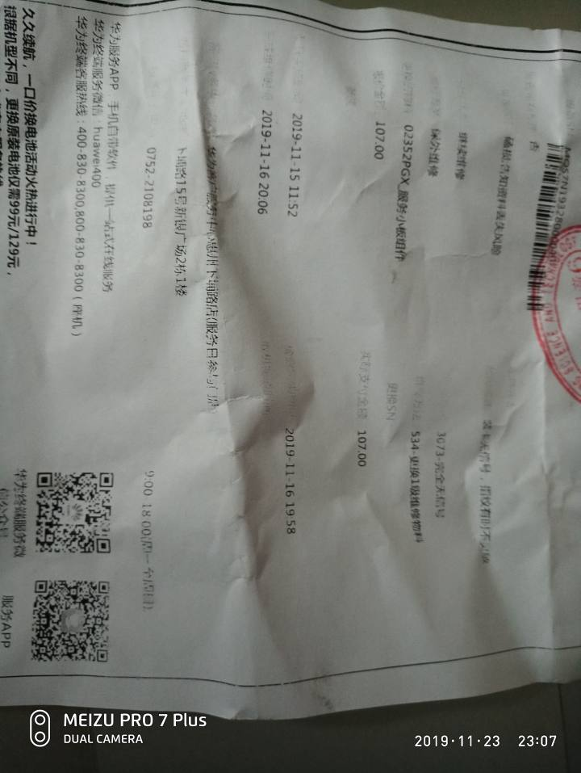
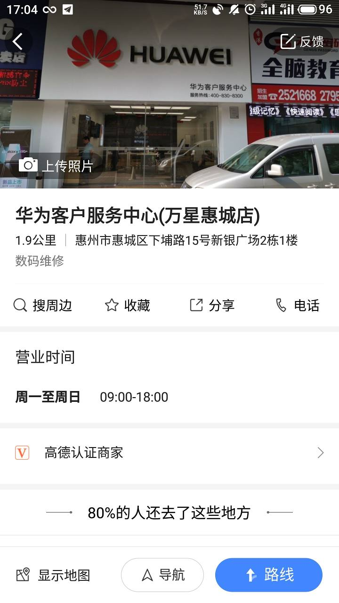
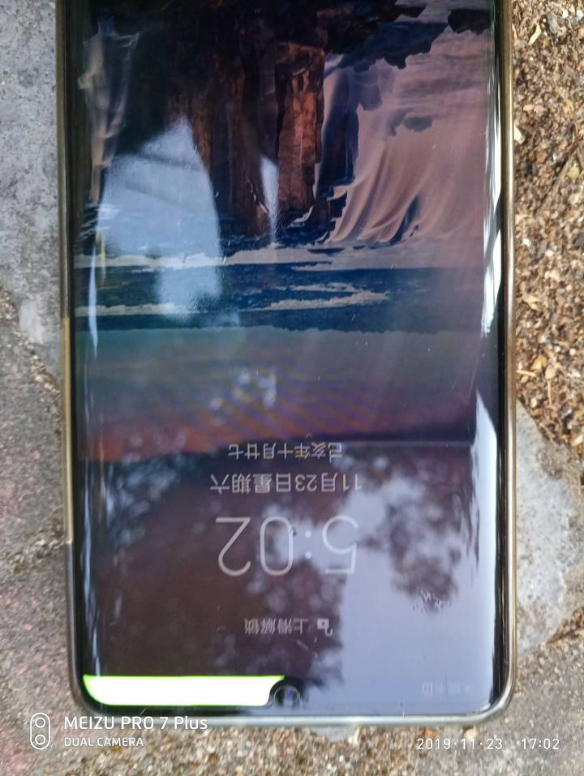
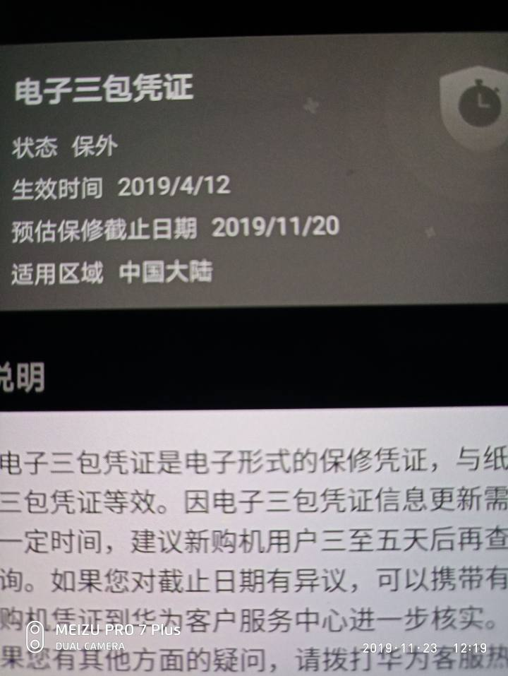
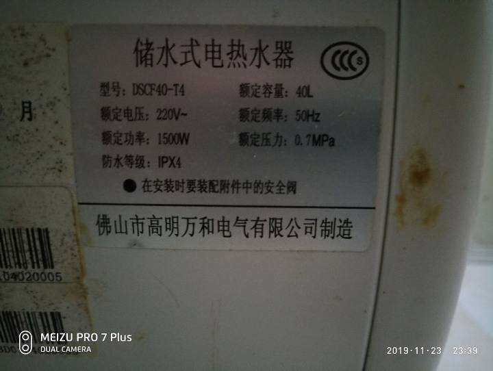
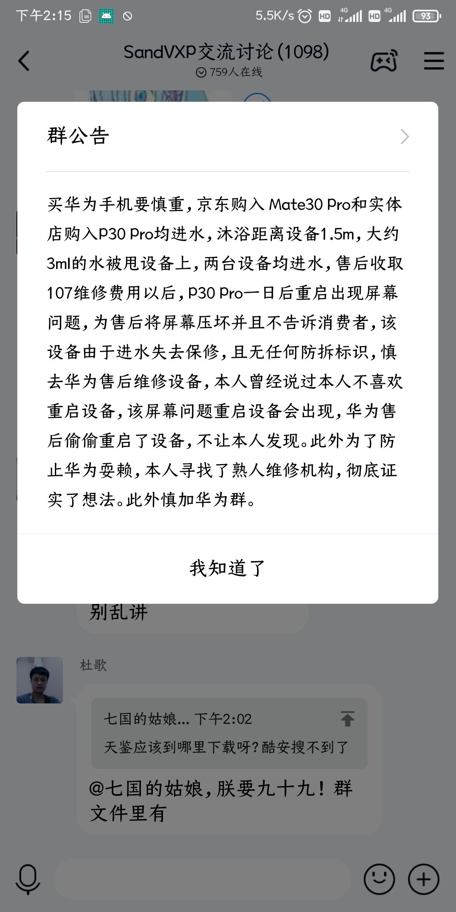

# 华为 Mate 30 Pro 和 P30 Pro 防水造假以及售后损坏部件导致过保
## 事件经过
### 2019.11.13
SandVXposed 作者 @lianglixin 于线下实体店购入一台华为P30 Pro，天空之境颜色
2019年11月13日，沐浴时将"3ml"自来水甩至机身上，设备不久后出现SIM卡不读卡的问题，同时出现问题的一台设备为Mate30 Pro黑色版
将P30 Pro移至售后维修，售后称“大量进水”，并否认水蒸气所致，并询问本人是否“泡手机”，得到否定的回复后，售后提出“P30 Pro”由于“零件不足”，需要等零件到才可更换，此时本人透露出设备不会频繁关机的信息。本人留机维修，由于上班匆忙，过了5天才将设备取回，取回时为VOG-AL00机型的维修缴纳107元物料更换费用。

### 2019.11.24
设备取回后，过了两天，由于系统升级，重启了设备，设备屏幕即出现花屏问题，出于对华为的信赖，本人取回设备时并没有重启检查。直到设备更新才发现此问题。此问题在设备开机时，大部分内容为黑色的情况下会立即出现，明显为屏幕被压坏
暂且放着另一台设备不管，经过和客服的沟通，客服表示，由于进水机是被标记的，因此出门不保，所以若屏幕非人为原因，并且在和进水无关的问题下出现问题，是否应该继续提供售后？
几个疑问：
1、华为的IP68是否为虚假宣传？ 
2、IPX4防水是否比“华为标准”的IP68更好？ 
3、售后为何不传达屏幕有损坏的信息？

## 参考资料
- [typedef2的动态 - 酷安网](https://www.coolapk.com/feed/15018699?shareKey=Njk3ZjNmNTY4MTVhNWRkYTI5ZmI)
