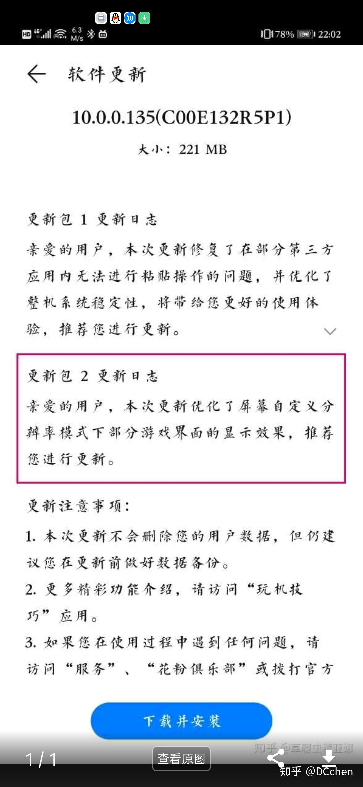

# 华为 Mate 系列手机强制降分辨率
## 事件经过
### 2019.10
Mate30 用户拿到手机后发现在玩游戏的时候，没有经过用户的同意华为就把分辨率降低了，且无法调整为正常的分辨率。
### 2019.11
系统更新解决了该问题。

## 参考资料
- [如何看待华为 Mate30 系列疑似扩大「降分辨率」名单的操作，真实情况如何？可能的原因有哪些？](https://www.zhihu.com/question/348101584)