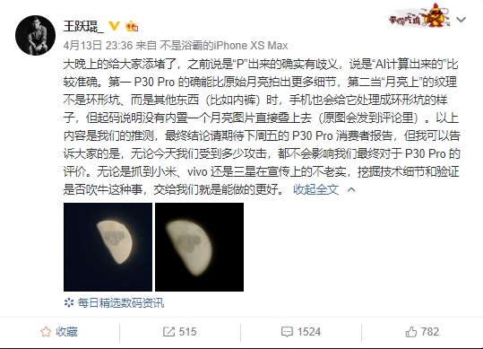

# 华为 P30 Pro 拍月亮造假
## 事件经过
### 2019.4.13
爱否科技高级主笔王跃琨在微博称，使用华为 P30 Pro 拍摄了一张“内裤月亮图”，月亮中被 P上了内裤图案，然后发现 P30 Pro 自动将月亮中的内裤处理成了环形山的形状，因此得出了华为 P30 Pro 会处理月亮照片的结论。

随后引起广泛的讨论。

### 2019.4.16
爱否科技发布官方声明，王跃琨作为爱否科技高级主笔，测试不严谨，误导用户煽动情绪，在业内造成不良影响，决议立即开除。  
另外，爱否科技视频内容停更一个月，团队成员集中深度学习。

### 2019.4.21
知乎网友经过试验，证实了 P30 Pro 会“无中生有”进行 P 月。

## 参考资料
- [微博大V质疑华为P30 Pro拍月亮造假：评测不严谨 被公司开除](https://www.cnbeta.com/articles/tech/838135.htm)
- [如何看待爱否科技前员工王跃琨称华为 P30 Pro 拍的月亮是 PS 的?](https://www.zhihu.com/question/319986727/answer/652664005)
