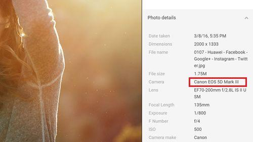

# 华为 P9 拍摄样张造假
## 事件经过
华为公司近日在社交平台Google+华为官方主页上发布了一张照片，用以强调旗下最新旗舰P9的超高拍照实力。该照片效果十分惊艳，细节表现完美，然而经证实该照片实为佳能高端单反拍摄。

## 参考资料
- [网友爆料：华为P9用单反拍摄的样张做宣传](https://www.tuicool.com/articles/VzQryqy)（腾讯新闻原文已被删除）
- [华为被指用单反照片冒充新旗舰P9拍摄：官方已道歉](https://www.toutiao.com/a6303663179127210241/)
- [如何评价华为P9样张造假？](https://www.zhihu.com/question/47230672)