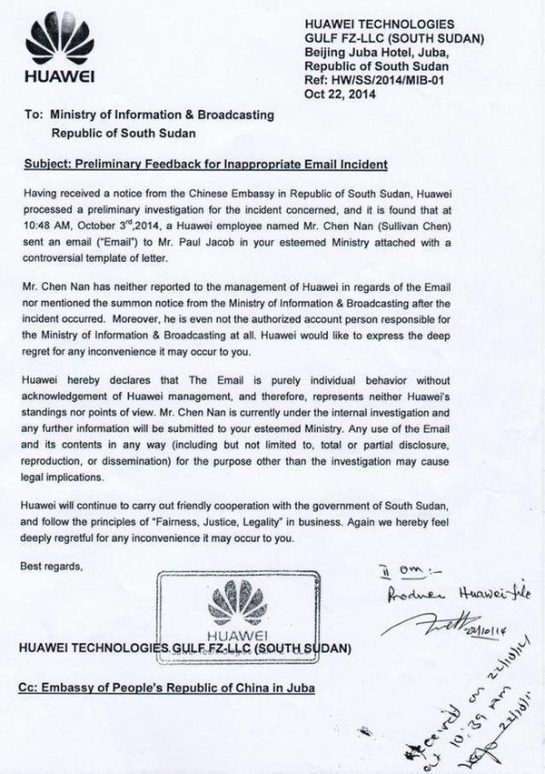
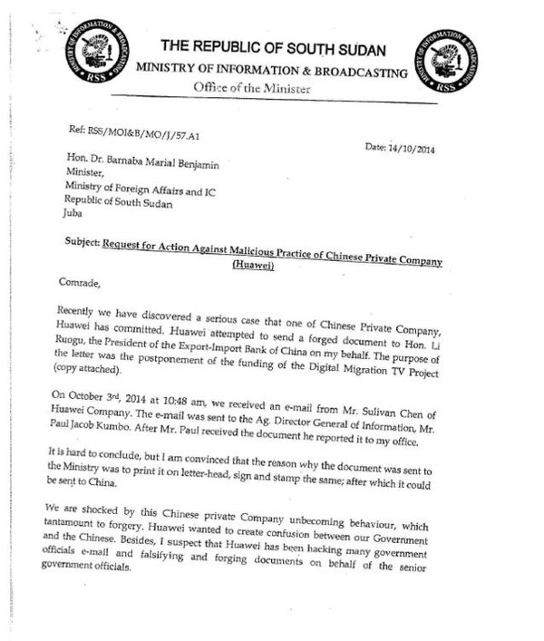
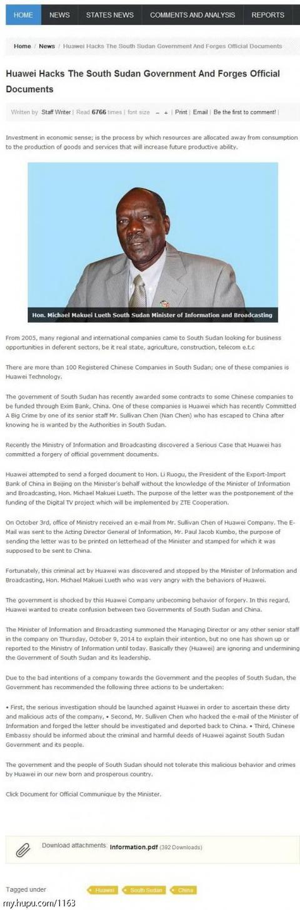

# 华为员工入侵南苏丹政府并伪造官方文件【存疑】
## 事件经过
### 2014.10.3
华为员工 Chen Nan 向出口银行行长发了一封伪造的南苏丹政府文件，旨在推迟给中兴的一批项目资金。

### 2014.10.17
苏丹外交部长指出华为的不当行为。

### 2014.10.22
华为道歉，并表示这是员工的个人行为，公司不知情。

## 相关资料
- [华为碉堡了，在南苏丹伪造政府公文遭通缉](https://www.sohu.com/a/29903990_231413)
- [Chinese Company, HUAWEI Technologies, Apologizes for “Malicious Practices” In South Sudan!](https://www.nyamile.com/2014/10/29/chinese-company-huawei-technologies-apologizes-for-malicious-practices-in-south-sudan/)

## 存疑点
目前只能证实这是员工的个人行为，不代表公司。
