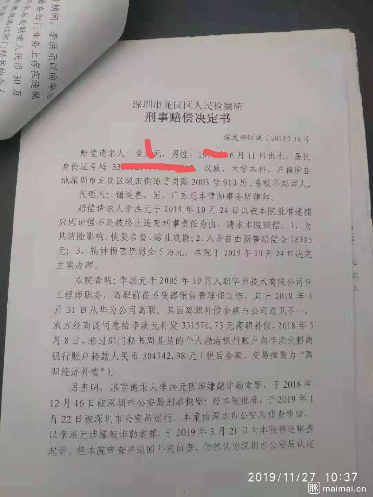
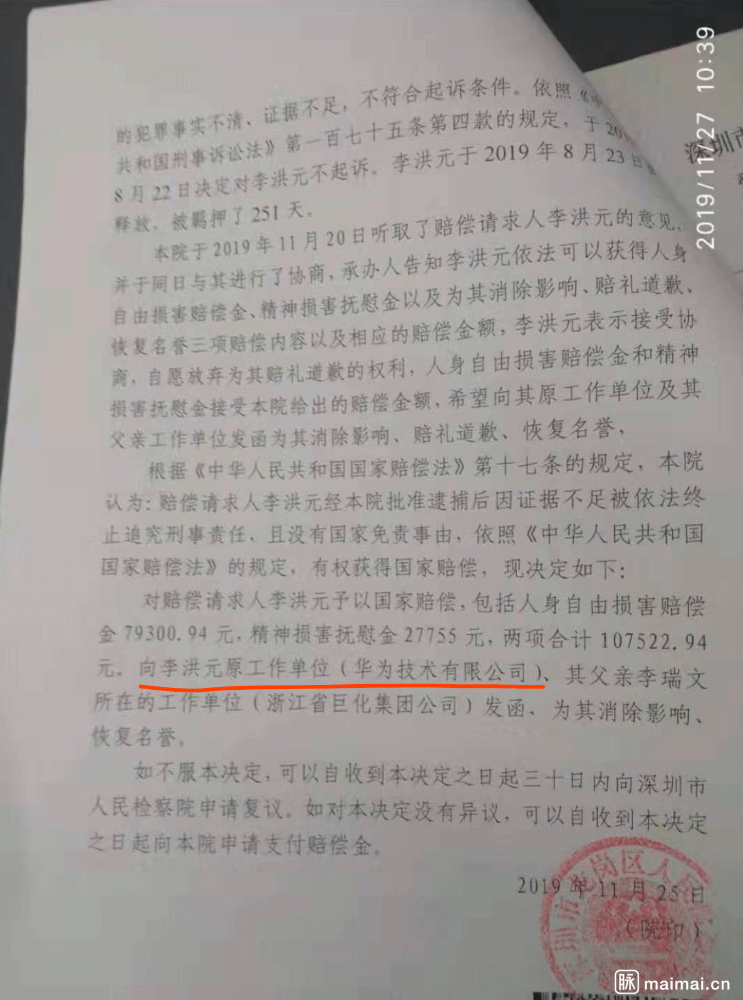
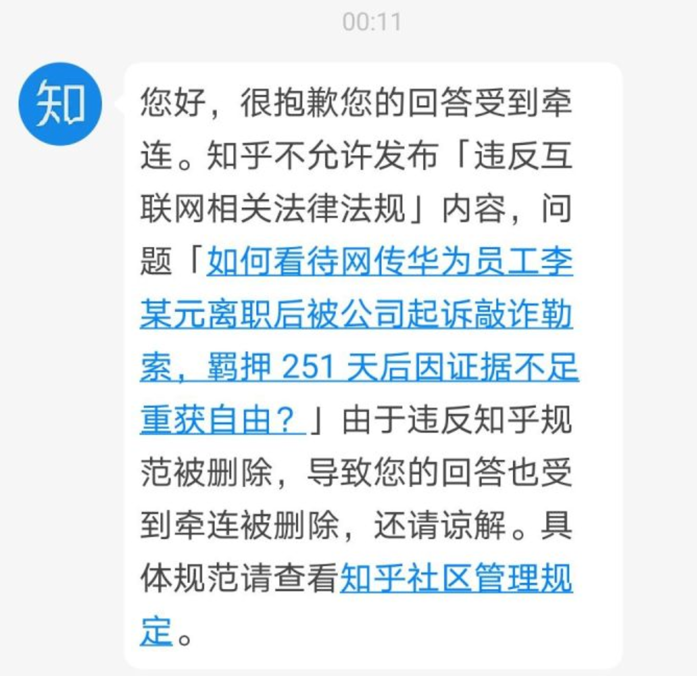
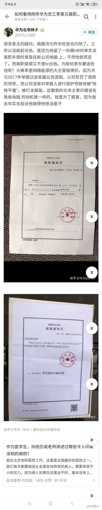
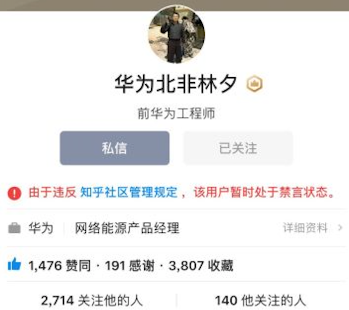
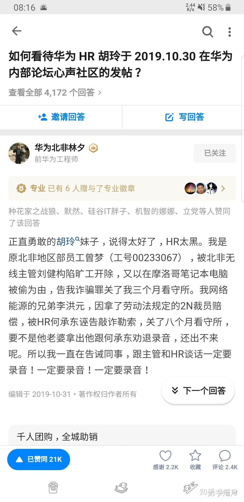
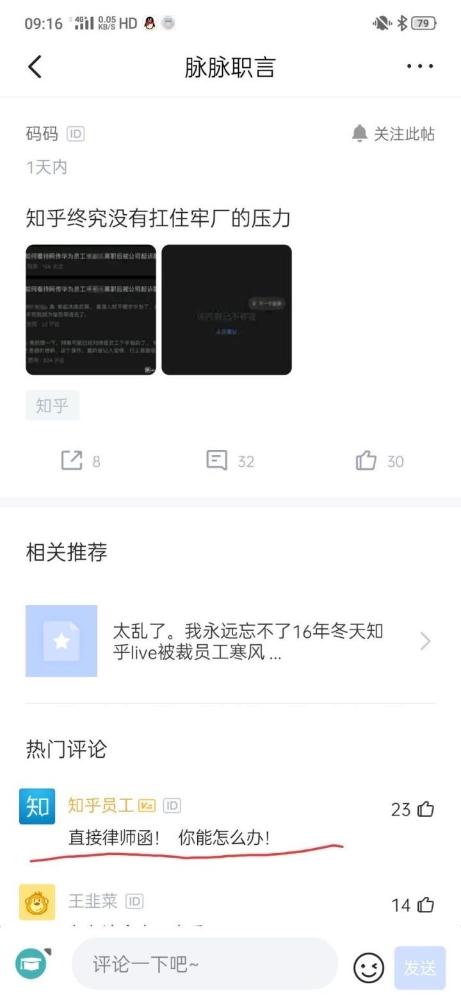

# 华为员工离职被公司起诉并羁押 251 天
## 事件经过
### 2019.11.28（具体日期存疑）
脉脉上曝光了一份关于华为离职员工李洪元的裁决书，华为前员工李洪元在离职获得 2N 赔偿后，又被起诉敲诈勒索，被羁押251天，近日因证据不足被释放。

### 2019.11.28
知乎有网友提问「[如何看待网传华为员工李某元离职后被公司起诉敲诈勒索，羁押 251 天后因证据不足重获自由？](https://www.zhihu.com/question/358237309)」，在知乎上引起了上亿的热度，1000 多条回答。  
同时微博、脉脉等社区事件也开始发酵。

### 2019.11.30
凌晨 00:13，知乎删除了该问题，随后开始删除相关问题。

同时接触了当事人的账号「华为北非林夕」被禁用，后续相关提问不断被删除和禁用账号。  

251 事件之前，「华为北非林夕」（已被封禁）在 https://www.zhihu.com/answer/916689789 发表的回答，目前也已被删除。

脉脉有知乎员工爆料收到了华为的律师函，迫于压力删帖。

同时大家发现知乎热度一直在掉，微博开始封禁相关话题。

## 参考资料
基本已经 404，这里会尽量收集截图。
- [如何看待网传华为员工李某元离职后被公司起诉敲诈勒索，羁押 251 天后因证据不足重获自由？](https://www.zhihu.com/question/358237309) （原问题，已 404，[Google Cache](https://webcache.googleusercontent.com/search?q=cache:u4RKmqAWRJwJ:https://www.zhihu.com/question/358237309&hl=en&strip=1&vwsrc=0) ）

Google Cache 截图：

Google Cache 快照：  
[zhihu-huawei251/2019.11.29 07:30:07 GMT网页快照.nojs.html](https://github.com/zhihu-huawei251/zhihu-huawei251/blob/master/2019.11.29%2007:30:07%20GMT%E7%BD%91%E9%A1%B5%E5%BF%AB%E7%85%A7.nojs.html)

- [如何看待前华为员工李某元被公司起诉敲诈，羁押251天后因证据不足重获自由？](https://www.zhihu.com/question/358526205/) （后续提问）
- [华为离职员工被诉敲诈，关押251天，是真的吗？](https://www.zhihu.com/question/358572396) （后续提问）

## 相关项目
- [zhihu-huawei251/zhihu-huawei251](https://github.com/zhihu-huawei251/zhihu-huawei251)