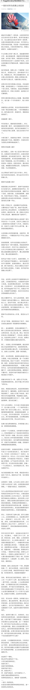

# 华为黑公关评“黑公关”华为
## 事件经过

微信公众号至道学宫发表了文章《一场针对华为的黑公关狂欢》

文章说 最近有关华为的251事件和华为前HR胡玲事件是“黑公关”炒作抹黑华为。

但我要指出，无论是发表在华为员工论坛的“心声”还是251事件的司法判决，都是事实。其中被华为起诉的员工李洪元无罪释放。

将公布司法判决定性为对华为的抹黑，是何居心？此外，华为高管余承东疑似转发了该文章，岂不是让文章作者更满足了文章中“黑公关”的定义？

## 参考资料
- [华为 HR 五千字实名控诉：研发兄弟一个月加班 160 小时却被说不努力](https://anti-wawei.icu/events/%E5%8D%8E%E4%B8%BA%20HR%20%E4%BA%94%E5%8D%83%E5%AD%97%E5%AE%9E%E5%90%8D%E6%8E%A7%E8%AF%89%EF%BC%9A%E7%A0%94%E5%8F%91%E5%85%84%E5%BC%9F%E4%B8%80%E4%B8%AA%E6%9C%88%E5%8A%A0%E7%8F%AD%20160%20%E5%B0%8F%E6%97%B6%E5%8D%B4%E8%A2%AB%E8%AF%B4%E4%B8%8D%E5%8A%AA%E5%8A%9B/)
- [华为员工离职被公司起诉并羁押 251 天](https://anti-wawei.icu/events/%E5%8D%8E%E4%B8%BA%E5%91%98%E5%B7%A5%E7%A6%BB%E8%81%8C%E8%A2%AB%E5%85%AC%E5%8F%B8%E8%B5%B7%E8%AF%89%E5%B9%B6%E7%BE%81%E6%8A%BC%20251%20%E5%A4%A9/)

- [如何评价华为高管余承东疑似转发文章《一场针对华为的黑公关狂欢》一事？] (https://www.zhihu.com/question/359281751/)