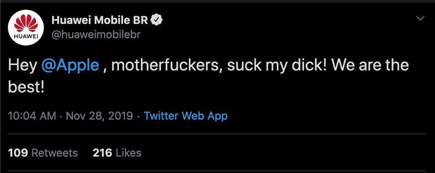

# 巴西华为官方推特辱骂苹果事件【存疑】
## 事件经过
### 2019.11.28
华为移动巴西「Huawei Mobile BR」官方推特帐号出现对 @Apple 飙脏话的推文。

据华为相关人士回应称，推特被盗，已删除相关内容。

## 相关资料
- [华为推特飙脏话骂苹果？华为相关人士回应：账号被盗](https://tech.sina.com.cn/mobile/n/n/2019-11-29/doc-iihnzahi4168315.shtml) ([archive1](https://web.archive.org/web/20191202113018/https://tech.sina.com.cn/mobile/n/n/2019-11-29/doc-iihnzahi4168315.shtml))
- [如何看待华为巴西对苹果发表的一些言论？](https://www.zhihu.com/question/358457569) ([archive1](https://web.archive.org/web/20191202112933/https://www.zhihu.com/signin?next=http://www.zhihu.com/question/358457569))
